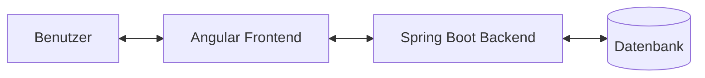

# Projektdokumentation - Fahrtenbuch

Diese Dokumentation bietet einen umfassenden Überblick über das Fahrtenbuch-Projekt, bestehend aus einem Spring Boot Backend und einem Angular Frontend.

## 📋 Inhaltsverzeichnis

1. [Architektur-Übersicht](#-architektur-übersicht)
2. [Server-Dokumentation (Backend)](#-server-dokumentation-backend)
3. [Client-Dokumentation (Frontend)](#-client-dokumentation-frontend)
4. [Deployment & Infrastruktur](#-deployment--infrastruktur)
5. [Besonderheiten](#-besonderheiten)

---

## 🏗 Architektur-Übersicht

Das Projekt ist als klassische Client-Server-Anwendung konzipiert. Das Backend stellt eine REST-API zur Verfügung, die vom Angular-Frontend konsumiert wird.



- **Backend:** Spring Boot 4.x, Java 25, Spring Data JPA, Spring Security (OAuth2).
- **Frontend:** Angular 19, TypeScript, Signals, HTML/CSS.
- **Datenbank:** H2 (Entwicklung) / PostgreSQL (Produktion).

---

## 🖥 Server-Dokumentation (Backend)

Detaillierte Informationen zum Backend finden Sie in den folgenden Dokumenten:

- 🏛 **[Architektur & Schichtenmodell](docs/server/architecture.md)**: Erläuterung des Aufbaus und der verwendeten Patterns.
- 📊 **[Datenmodell](docs/server/data-model.md)**: Beschreibung der Entities und deren Beziehungen (ER-Diagramm).
- 🔌 **[API-Referenz](docs/server/api.md)**: Dokumentation der REST-Endpunkte und Datenformate.
- 📦 **[Paket- & Klassenstruktur](docs/server/packages.md)**: Detaillierte Liste aller Pakete und Klassen.

---

## 🌐 Client-Dokumentation (Frontend)

Detaillierte Informationen zum Frontend finden Sie in den folgenden Dokumenten:

- 🚀 **[Übersicht & Routing](docs/client/overview.md)**: Einführung in die Angular-Anwendung und UI-Flow.
- 🧱 **[Komponenten](docs/client/components.md)**: Beschreibung der UI-Bausteine und deren Funktionen.
- ⚙️ **[Services & State](docs/client/services.md)**: Details zur Geschäftslogik und dem Signal-basierten State-Management.
- 📄 **[Datenmodelle](docs/client/models.md)**: TypeScript-Interfaces und Enums.

---

## 🚀 Deployment & Infrastruktur

Die Anwendung ist für den Betrieb in Docker-Containern optimiert.

### Build-Prozess
Der Client wird als Teil des Gradle-Build-Prozesses gebaut und die statischen Dateien werden in das JAR-File integriert.

```bash
./gradlew build
```

### Docker
Ein Docker-Image kann mit dem bereitgestellten `Dockerfile` erstellt werden. Details zum Deployment finden sich in der [README.md](README.md).

---

## ✨ Besonderheiten

### OAuth2 Integration
Die Anwendung nutzt Google OAuth2 zur Authentifizierung. Die Konfiguration erfolgt über Umgebungsvariablen:
- `GOOGLE_CLIENT_ID`
- `GOOGLE_CLIENT_SECRET`

### Datenbank & Migrationen
- Entwicklung: H2 (Datei/In-Memory) • Produktion: PostgreSQL
- Flyway-Migrationen liegen unter `src/main/resources/db/migration`
- Aktuelle Einstellung: `spring.jpa.hibernate.ddl-auto=update` (siehe `src/main/resources/application.yaml`)

### CSV-Export
In der Fahrtenliste (`DriveList`) ist ein CSV-Export implementiert, der die aktuell gefilterte Ansicht exportiert. Dies ist besonders nützlich für die Steuererklärung.

### Home-Office Tracking
Über den speziellen Grund `HOME` (Home-Office) können Tage erfasst werden, an denen nicht gefahren wurde, was ebenfalls für die steuerliche Absetzbarkeit relevant ist.
