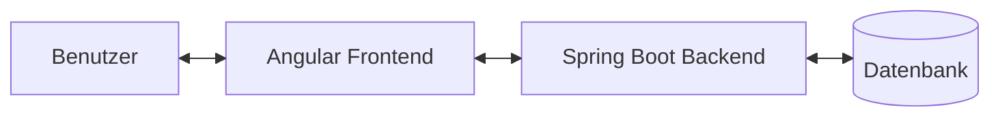

# Projektdokumentation - Fahrtenbuch

Dieses Dokument dient als Einstiegspunkt für die gesamte Dokumentation des Fahrtenbuch-Projekts. Die Anwendung ermöglicht die effiziente Erfassung von Fahrten auf Basis von Vorlagen, inklusive Unterstützung für Home-Office-Tage und CSV-Export für die Steuererklärung.

## 🧭 Inhaltsverzeichnis

1.  [**Backend-Dokumentation (Server)**](#-backend-dokumentation-server)
2.  [**Frontend-Dokumentation (Client)**](#-frontend-dokumentation-client)
3.  [**Architektur & Design-Entscheidungen**](#-architektur--design-entscheidungen)
4.  [**Besonderheiten & Workflows**](#-besonderheiten--workflows)
5.  [**Versionierung**](#-versionierung)

---

## 🖥 Backend-Dokumentation (Server)

Das Backend ist mit Spring Boot 4 (Java 25) realisiert und verwaltet die Datenhaltung sowie die Geschäftslogik.

- 🏗 **[Architektur & Schichtenmodell](docs/server/architecture.md)**: Details zum Aufbau der Anwendung und der Schichtentrennung.
- 📊 **[Datenmodell](docs/server/data-model.md)**: ER-Diagramm und detaillierte Beschreibungen der Entities (`Drive`, `DriveTemplate`).
- 🛫 **[DB-Migrationen (Flyway)](docs/server/database-migrations.md)**: Baseline-Strategie, Versionierung und Startup-Migration pro Tenant.
- 🔌 **[API-Referenz](docs/server/api.md)**: Dokumentation der REST-Endpunkte, DTOs und Fehlerbehandlung.
- 📦 **[Paket- & Klassenstruktur](docs/server/packages.md)**: Detaillierte Übersicht aller Java-Packages und Klassen-Verantwortlichkeiten.

---

## 🌐 Frontend-Dokumentation (Client)

Das Frontend basiert auf Angular 21 und bietet eine moderne, reaktive Benutzeroberfläche.

- 🚀 **[Übersicht & Routing](docs/client/overview.md)**: UI-Flow, Navigationsstruktur und Mobil-Optimierungen.
- 🧱 **[Komponenten](docs/client/components.md)**: Detaillierte Beschreibung der Formulare und Listenansichten.
- ⚙️ **[Services & State](docs/client/services.md)**: Kommunikation mit dem Backend und State-Management mittels Signals.
- 📄 **[Datenmodelle](docs/client/models.md)**: TypeScript-Interfaces und Enums für die clientseitige Datenhaltung.

---

## 🏗 Architektur & Design-Entscheidungen

### Schichtenmodell
Die Anwendung folgt einem klassischen Schichtenmodell (Controller -> Service -> Repository), wobei die Fachlogik strikt in den Services gekapselt ist.

### Multitenancy (Mehrbenutzerbetrieb)
Jeder Benutzer arbeitet auf seiner eigenen Datenbank (isolierte Datenhaltung).
- **Identifikation:** Über Google OAuth2 (E-Mail).
- **Datenhaltung:** Pro Benutzer eine eigene H2-Datenbankdatei (oder PostgreSQL-Schema).
- **Automatisierung:** Flyway migriert `default` beim Serverstart und weitere Tenant-Datenbanken beim ersten Zugriff.

---

## ✨ Besonderheiten & Workflows

### Flexibilität bei Fahrten
Fahrten können sowohl **mit** als auch **ohne** Vorlage erfasst werden.
- **Ohne Vorlage:** Alle fahrtrelevanten Daten (Von, Nach, Länge, Grund) müssen manuell eingegeben werden.
- **Mit Vorlage:** Die Vorlage liefert Standardwerte. Diese können jedoch individuell pro Fahrt überschrieben werden (Overrides).
- **Priorisierung:** In der Anzeige und im CSV-Export haben manuelle Overrides immer Vorrang vor den Vorlagenwerten.

### CSV-Export
Die Anwendung bietet einen integrierten CSV-Export in der Fahrtenliste. Dieser berücksichtigt die aktuell gesetzten Filter (Jahr, Monat, Grund), was die Vorbereitung der Steuererklärung erheblich vereinfacht.

### Home-Office Support
Über den speziellen Grund `HOME` können Home-Office-Tage erfasst werden. Auf Mobilgeräten wird hierbei die UI angepasst (kein Richtungspfeil), und in der Vorlagen-Definition ist für diesen Fall eine Länge von 0 km zulässig.

### Scan-Workflow
Die App unterstützt einen Scan-Flow für Start/Ziel: Geolocation + Foto werden hochgeladen, OCR liest den KM-Stand, Reverse-Geocoding ergänzt Adressen und der Nutzer kann daraus eine Fahrt erzeugen. Beim Commit kann ein `Grund` ausgewählt werden; falls keiner angegeben ist, wird `OTHER` verwendet. Tesseract wird über `TESSERACT_PATH` konfiguriert, optionale Native-Libs über `OCR_LIBRARY_PATH`. Im Backend werden Bilder für Tess4J als Graustufen-ByteBuffer übergeben (statt Lept4J-Bildkonvertierung), um Leptonica-Kompatibilitätsprobleme in Docker-Images zu vermeiden. Für Debugging können Zwischenbilder und OCR-Text über `OCR_DEBUG_ENABLED` und `OCR_DEBUG_DIR` ausgegeben werden; Details siehe `docs/server/architecture.md`.

---

## 🔖 Versionierung

Die App-Version wird **zentral** in `app.env` gepflegt.

1. `app.env` enthält genau einen Eintrag: `APP_VERSION=...`.
2. Gradle liest diese Version und verwendet sie als `project.version`.
3. `client/package.json` und `client/package-lock.json` werden vor `npmInstall` automatisch synchronisiert.
4. Docker-Compose Dateien verwenden `image: drives:${APP_VERSION}` und laden `app.env`.

Empfohlener Ablauf:
- Version nur in `app.env` ändern.
- Danach wie gewohnt bauen/ausliefern (`./gradlew build`, Docker-Image bauen).

---
> 💡 *Tipp: Weitere Informationen zum Deployment und zum Starten der Anwendung finden sich in der [README.md](README.md).*
