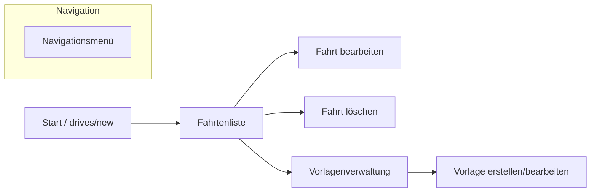

# Übersicht (Client)

Das Frontend des Fahrtenbuchs ist eine **Angular-Anwendung (v19)**, die als Single Page Application (SPA) konzipiert ist. Sie ermöglicht die Erfassung von Fahrten, die Verwaltung von Vorlagen und bietet Filter- sowie Exportmöglichkeiten.

## Architektur-Prinzipien

- **Komponentenbasiert:** Die UI ist in modulare Standalone-Komponenten unterteilt.
- **Service-gesteuert:** Die gesamte Kommunikation mit dem Backend und die State-Verwaltung erfolgt über Angular-Services.
- **Signals:** Die Anwendung nutzt Angular Signals für ein reaktives State-Management (z.B. für Filter und zuletzt gewählte Daten).
- **Type-Safe:** Konsequente Nutzung von TypeScript-Interfaces und Enums für Datenmodelle.

## Benutzeroberfläche (UI-Flow)

## Routing-Struktur

Die Routen sind in `app.routes.ts` definiert:

| Pfad | Komponente | Zweck |
| :--- | :--- | :--- |
| `/drives` | `DriveList` | Anzeige und Filterung aller Fahrten. |
| `/drives/new` | `DriveForm` | Erfassen einer neuen Fahrt. |
| `/drives/edit/:id` | `DriveForm` | Bearbeiten einer bestehenden Fahrt. |
| `/driveTemplates` | `DriveTemplateList` | Liste aller Fahrtvorlagen. |
| `/driveTemplates/new` | `DriveTemplateForm` | Erstellen einer neuen Vorlage. |
| `/driveTemplates/edit/:id` | `DriveTemplateForm` | Bearbeiten einer Vorlage. |
| `/` | - | Redirect auf `/drives/new`. |
