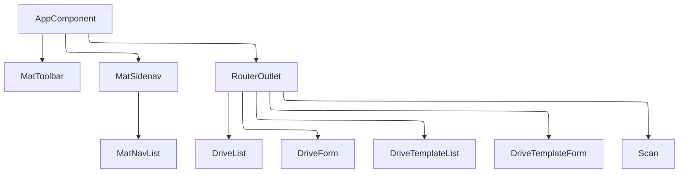

# Frontend-Übersicht & Routing

Das Angular-Frontend ist als Single-Page-Application (SPA) konzipiert und bietet eine intuitive Benutzeroberfläche zur Erfassung und Verwaltung von Fahrten.

## 🚀 Routing-Struktur

Die Navigation innerhalb der Anwendung wird über den Angular Router gesteuert (Hash-Location via `withHashLocation()`).

| Pfad | Komponente | Beschreibung |
| :--- | :--- | :--- |
| `/drives` | `DriveList` | Hauptliste aller Fahrten mit Filtern und Export. |
| `/drives/new` | `DriveForm` | Erfassung einer neuen Fahrt. |
| `/drives/edit/:id` | `DriveForm` | Bearbeiten einer bestehenden Fahrt. |
| `/scan` | `Scan` | Scannen von Start/Ziel (Foto, GPS, OCR) und Übernahme als Fahrt. |
| `/driveTemplates` | `DriveTemplateList` | Verwaltung der Fahrtvorlagen. |
| `/driveTemplates/new` | `DriveTemplateForm` | Erstellung einer neuen Vorlage. |
| `/driveTemplates/edit/:id` | `DriveTemplateForm` | Bearbeiten einer Vorlage. |
| `/` | (Redirect) | Startseite leitet auf `/drives/new` weiter. |

## 🏗 Komponenten-Hierarchie

## 📱 Mobil-Optimierungen & UX

Die Anwendung ist "Mobile First" gestaltet, um die Erfassung direkt im Fahrzeug zu erleichtern.

### Swipe-to-Delete
In den Listen (`DriveList`, `DriveTemplateList`) können Zeilen nach links gewischt werden, um eine Lösch-Aktion freizulegen. Dies ermöglicht eine schnelle Verwaltung ohne dedizierte Buttons in jeder Zeile auf kleinen Bildschirmen.

### Scroll-Verhalten
Um die Übersichtlichkeit zu wahren, wurde ein spezielles CSS-Layout implementiert:
- Die Filter und Aktions-Buttons oben bleiben statisch (Sticky-Header-Effekt).
- Nur der Tabelleninhalt (`mat-table`) innerhalb des `table-container` ist vertikal scrollbar.

### Dynamische UI-Elemente
- **Pfeil-Separator:** In der Liste wird zwischen Start und Ziel ein Pfeil angezeigt. Bei `HOME` (Home-Office) wird dieser ausgeblendet, da kein physischer Weg zurückgelegt wurde.
- **Formular-Validierung:** Die Pflichtfelder passen sich dynamisch an, je nachdem ob eine Vorlage gewählt wurde oder nicht.
- **Scan-Flow:** Der Scan-Screen nutzt Geolocation und Foto-Upload. Start- und Ziel-Scans werden per OCR (KM-Stand) und Reverse-Geocoding (Adresse) ergänzt und können als Fahrt übernommen werden.

## 🛠 Technologien
- **Angular 21**
- **Angular Material** & **CDK**
- **Signals** (State-Management)
- **RxJS** (Streams/Interop)
- **Vitest** (Unit-Testing)
