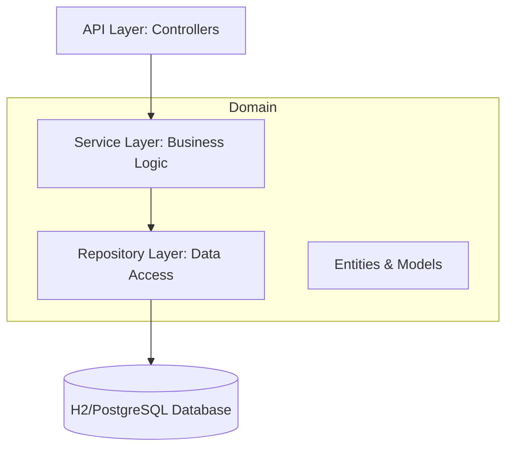

# Architektur (Server)

Die Backend-Architektur folgt dem Prinzip **Package-by-Feature** und ist innerhalb der Features in Schichten unterteilt.

## Schichtenmodell

### 1. Web-Schicht (API)
Verantwortlich für das Handling von HTTP-Anfragen, Validierung von Eingaben (via Jakarta Validation) und Rückgabe von standardisierten Antworten. 
- **Technologien:** Spring Web, Spring Security.

### 2. Service-Schicht (Domain Services)
Hier befindet sich die Geschäftslogik. Transaktionsgrenzen werden auf dieser Ebene definiert (`@Transactional`).
- **Besonderheit:** Verwendung von Command-Objekten zur Entkopplung von der Web-Schicht.

### 3. Repository-Schicht (Domain Repositories)
Abstrahiert den Datenbankzugriff. 
- **Technologien:** Spring Data JPA.

## Besondere Merkmale

### Sicherheit & Authentifizierung
Die Anwendung nutzt **OAuth2 Login** (Google). 
- Konfiguriert in `SecurityConfig`.
- Erfordert gültige Client-ID und Client-Secret in der Umgebung (`GOOGLE_CLIENT_ID`, `GOOGLE_CLIENT_SECRET`).
- CSRF-Schutz ist aktiviert und nutzt ein Cookie-basiertes Verfahren, das mit dem Angular-Frontend kompatibel ist.

### Datenbank-Management
Die Anwendung nutzt JPA zur Persistenz. 
- In der Entwicklung wird typischerweise eine H2-In-Memory-Datenbank oder eine lokale PostgreSQL-Instanz genutzt.
- Die Schema-Validierung erfolgt beim Start (`ddl-auto=validate`).

### Dependency Injection
Es wird konsequent auf **Constructor Injection** gesetzt. Lombok wird verwendet, um Boilerplate-Code wie Konstruktoren, Getter und Setter zu minimieren.
