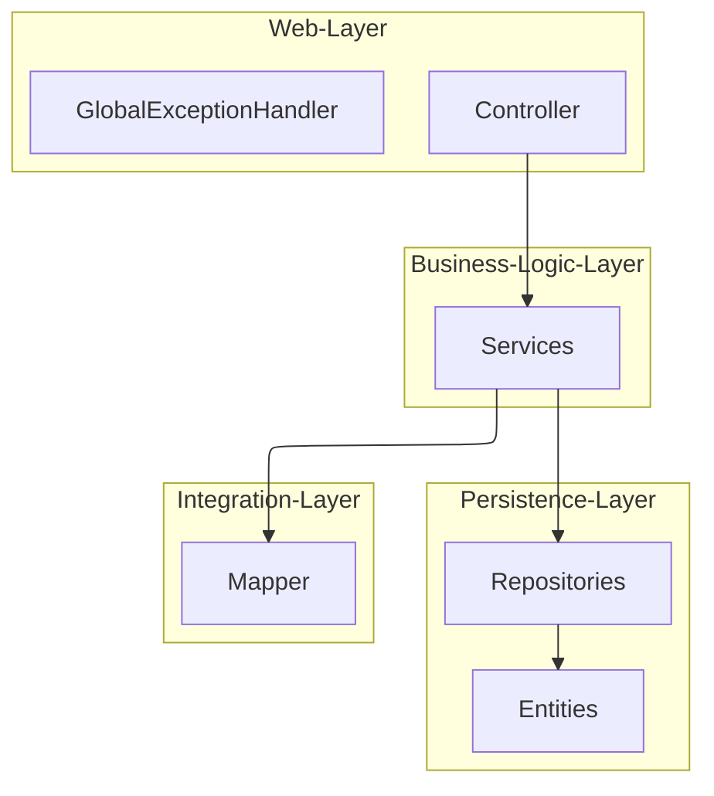

# Server-Architektur & Schichtenmodell

Das Backend ist als Spring Boot 4 Anwendung (Java 25) konzipiert und folgt einem klassischen Schichtenmodell, um eine saubere Trennung der Verantwortlichkeiten zu gewährleisten.

## 🏛 Schichtenmodell

### 1. Web-Layer (`api.controllers`, `api.handlers`)
- **Controller:** Definieren die REST-Endpunkte und validieren eingehende Daten mittels Jakarta Validation (auf DTO-Ebene).
- **ExceptionHandler:** Fängt Exceptions ab und wandelt sie in benutzerfreundliche HTTP-Antworten (JSON) um.

### 2. Business-Logic-Layer (`domain.services`)
- **Services:** Enthalten die eigentliche Fachlogik. Hier werden Transaktionsgrenzen (`@Transactional`) definiert.
- **Validierung:** Komplexe fachliche Prüfungen (z.B. "Darf eine Vorlage gelöscht werden?") finden hier statt.
- **Normalisierung:** Der `DriveService` bereinigt Daten vor dem Speichern (Entfernen redundanter Template-Werte).
- **Scan-Pipeline:** `ScanEntryService` orchestriert OCR (KM-Stand) und Reverse-Geocoding und erzeugt daraus eine Fahrt.

### 3. Persistence-Layer (`domain.repositories`, `domain.entities`)
- **Entities:** JPA-annotierte Klassen, die das Datenbank-Schema repräsentieren.
- **Repositories:** Spring Data JPA Interfaces für den Datenbankzugriff.

### 4. Integration-Layer (`domain.mappers`)
- **Mapper:** Verantwortlich für die Konvertierung zwischen internen Entities und externen DTOs.
- **Fallback-Logik:** Hier ist die Logik implementiert, die entscheidet, ob ein Wert aus der Fahrt oder aus dem Template angezeigt wird.

## 🔑 Kern-Konzepte

### Multitenancy (Mehrbenutzerfähigkeit)
Die Anwendung unterstützt mehrere Benutzer (Tenants) mit strikt getrennten Daten.
1. **Identifikation:** Der Tenant wird über das OAuth2-Principal (E-Mail) ermittelt.
2. **Isolierung:** Jeder Tenant erhält eine eigene Datenbankdatei (bei H2) bzw. ein eigenes Suffix.
3. **Dynamik:** Die Datenbankverbindung wird "Just-in-Time" beim ersten Request des Benutzers aufgebaut.
4. **Schema-Management:** Flyway migriert die `default`-Datenbank beim Serverstart und jede weitere Tenant-Datenbank direkt bei deren erster Erstellung.

### Datenbank-Migrationen (Flyway)
- **Single Source of Truth:** DDL-Änderungen werden ausschließlich als Flyway-Migrationen gepflegt.
- **Sicherheit:** `spring.jpa.hibernate.ddl-auto=validate` verhindert unkontrollierte Schema-Änderungen durch JPA.
- **Übergang bestehender DBs:** Bestehende aktuelle Datenbanken werden per Baseline übernommen und danach normal versioniert.

### Externe Dienste
- **OCR:** Tesseract (via Tess4J) extrahiert den KM-Stand aus Fotos; der erste Pass arbeitet auf einem unteren Bildstreifen (Band-Crop) mit `PSM_SINGLE_LINE` und Ziffern-Whitelist. Der normale Pass erhöht Kontrast/Helligkeit, entfernt Schatten (Dilation + Median-Blur + Normalisierung) und binarisiert per Otsu; der Relaxed-Pass nutzt dieselbe Normalisierung ohne harte Binarisierung.
- **Geocoding:** Nominatim (OpenStreetMap) liefert Adressen für GPS-Koordinaten; Straße und Hausnummer werden ohne Komma kombiniert.

### OCR-Debugging (optional)
Für Problemfälle (z.B. OCR-Ergebnisse unterscheiden sich zwischen Desktop und Docker) kann Debug-Ausgabe aktiviert werden.
1. Setze `OCR_DEBUG_ENABLED=true`.
2. Setze `OCR_DEBUG_DIR` auf ein beschreibbares Verzeichnis (z.B. `/root/data/ocr-debug` im Container).
3. Für jeden OCR-Request wird ein Unterordner mit Zwischenbildern und Texten erzeugt.

Artefakte pro Request:
- `01-original.png` (Originalbild)
- `02-cli-like.png` (unterer Bildstreifen für den ersten OCR-Pass)
- `03-prepared.png` (Vorverarbeitung mit Kontrast/Shadow-Removal + Otsu)
- `04-relaxed.png` (Shadow-Removal ohne harte Binarisierung)
- `ocr-cli-like.txt` (OCR-Text aus CLI-ähnlichem Pass)
- `ocr-primary.txt` (OCR-Text aus dem normalen Pass)
- `ocr-fallback.txt` (OCR-Text aus Relaxed-Fallback)

### Command Pattern
Für Schreiboperationen werden dedizierte `Command`-Objekte (Records) verwendet. Dies entkoppelt die API-Struktur (DTOs) von der internen Service-Logik und ermöglicht eine saubere Validierung, bevor Daten die Entities erreichen.

### Transaktionsmanagement
Schreibzugriffe sind immer transaktional. Bei Fehlern während einer Operation (z.B. Datenbank-Constraint-Verletzung) wird ein Rollback durchgeführt, um die Datenintegrität zu wahren.

## Transaktionen

- Lesevorgänge: `@Transactional(readOnly = true)`
- Schreibvorgänge: `@Transactional` in Services

## Validierung

- Zentral in `DriveService.validateDrive(...)`: Ohne Vorlage sind genannte Pflichtfelder erforderlich; sonst wird reduziert gespeichert.
