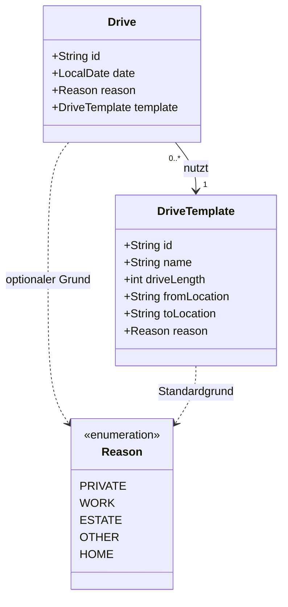

# Datenmodell (Server)

Dieses Dokument beschreibt das Datenmodell des Fahrtenbuch-Backends. Das Modell ist darauf optimiert, Fahrten effizient zu erfassen, wobei häufig genutzte Strecken als Vorlagen gespeichert werden können.

## Entity-Relationship-Diagramm



## Entities

### Drive (Fahrt)
Repräsentiert eine einzelne durchgeführte Fahrt.

| Attribut | Typ | Beschreibung |
| :--- | :--- | :--- |
| `id` | `String` (UUID) | Eindeutiger Identifikator der Fahrt. |
| `date` | `LocalDate` | Datum, an dem die Fahrt stattgefunden hat. |
| `template` | `DriveTemplate` | Die zugrunde liegende Vorlage für diese Fahrt. |
| `reason` | `Reason` | Grund der Fahrt. Wenn dieser `null` ist, wird der Grund aus dem Template verwendet. |

### DriveTemplate (Fahrtvorlage)
Definiert eine häufig gefahrene Strecke.

| Attribut | Typ | Beschreibung |
| :--- | :--- | :--- |
| `id` | `String` (UUID) | Eindeutiger Identifikator der Vorlage. |
| `name` | `String` | Eindeutiger Name der Vorlage (z.B. "Arbeitsweg"). |
| `driveLength`| `int` | Länge der Strecke in Kilometern. |
| `fromLocation`| `String` | Startpunkt der Fahrt. |
| `toLocation` | `String` | Zielpunkt der Fahrt. |
| `reason` | `Reason` | Standard-Grund für diese Vorlage. |

### Reason (Enum)
Definiert die Kategorisierung einer Fahrt.

- `PRIVATE`: Private Fahrt.
- `WORK`: Dienstliche Fahrt / Arbeitsweg.
- `ESTATE`: Fahrten im Zusammenhang mit Immobilien/Vermietung.
- `OTHER`: Sonstige Fahrten.
- `HOME`: Home-Office Tag (Sonderfall).

## Besonderheiten

### Reason-Normalisierung
In der Klasse `DriveService` findet eine Normalisierung des Grundes statt. Wenn der Grund einer Fahrt identisch mit dem Standardgrund der Vorlage ist, wird der Grund in der `Drive`-Entität auf `null` gesetzt, um Redundanz zu vermeiden.

```java
private void normalizeReason(Drive drive) {
    if (drive.getTemplate() != null && drive.getReason() == drive.getTemplate().getReason()) {
        drive.setReason(null);
    }
}
```
