# Datenmodell (Backend)

Das Datenmodell ist darauf ausgelegt, Fahrten effizient zu speichern, wobei sowohl feste Vorlagen als auch flexible manuelle Eingaben unterstützt werden.

## 📊 Entity-Beziehung (ER-Diagramm)

  

Quelle: [`docs/diagrams/server-data-model-er.mmd`](../diagrams/server-data-model-er.mmd)

## 📝 Entity-Details

### 1. `DriveTemplate`
Repräsentiert eine Vorlage für häufig wiederkehrende Fahrten (z.B. der tägliche Arbeitsweg).

| Feld | Typ | Beschreibung |
| :--- | :--- | :--- |
| `id` | `String (UUID)` | Primärschlüssel. |
| `name` | `String` | Eindeutiger Name der Vorlage (z.B. "Arbeitsweg"). |
| `driveLength` | `int` | Standard-Länge in Kilometern. |
| `fromLocation` | `String` | Standard-Startort. |
| `toLocation` | `String` | Standard-Zielort. |
| `reason` | `Reason (Enum)` | Standard-Zweck der Fahrt. |

### 2. `Drive`
Repräsentiert eine konkret durchgeführte Fahrt oder einen Home-Office-Tag.

| Feld | Typ | Beschreibung |
| :--- | :--- | :--- |
| `id` | `String (UUID)` | Primärschlüssel. |
| `template` | `DriveTemplate` | Optionale Verknüpfung zu einer Vorlage. |
| `date` | `LocalDate` | Datum der Fahrt. |
| `reason` | `Reason` | Optionaler Override für den Grund. |
| `fromLocation` | `String` | Optionaler Override für den Startort. |
| `toLocation` | `String` | Optionaler Override für den Zielort. |
| `driveLength` | `Integer` | Optionaler Override für die Länge. |

### 3. `ScanEntry`
Zwischenspeicher für Scan-Vorgänge (Start/Ziel), die später zu Fahrten verarbeitet werden.

| Feld | Typ | Beschreibung |
| :--- | :--- | :--- |
| `id` | `String (UUID)` | Primärschlüssel. |
| `type` | `ScanType` | `START` oder `ZIEL`. |
| `timestamp` | `OffsetDateTime` | Zeitpunkt des Scans. |
| `latitude` | `Double` | GPS-Breite. |
| `longitude` | `Double` | GPS-Länge. |
| `address` | `String` | Optional, via Reverse-Geocoding ermittelt. |
| `kmStand` | `Integer` | Per OCR extrahierter KM-Stand; kann `null` sein, wenn die Erkennung fehlschlägt. |

## ⚙️ Logik & Besonderheiten

### Speicherung (Normalisierung)
Um Redundanz in der Datenbank zu vermeiden, implementiert der `DriveService` eine Bereinigungslogik:
- Wenn ein Feld am `Drive` identisch mit dem Wert in der verknüpften `DriveTemplate` ist, wird das Feld am `Drive` auf `null` gesetzt.
- In der Datenbank werden somit nur die Abweichungen (Overrides) gespeichert.

### Auslese-Logik (Denormalisierung im Mapper)
Beim Laden einer Fahrt sorgt der `DriveMapper` dafür, dass der Client immer die "effektiven" Werte erhält:
1. Wenn ein Override am `Drive` existiert, wird dieser verwendet.
2. Wenn kein Override existiert, wird der Wert aus dem verknüpften `DriveTemplate` verwendet.
3. Wenn weder noch existiert (und kein Template vorhanden ist), wird `null` zurückgegeben.

### JPQL-Besonderheit (Repository)
In `DriveRepository.findFiltered` wird ein `LEFT JOIN` auf das Template verwendet. Dies ist kritisch, da ein Standard-Join (Inner Join) Fahrten ohne Template aus dem Ergebnis ausschließen würde.

### Schema-Migration
Das Projekt nutzt ausschließlich Flyway:
- **Versionierung:** Das komplette Schema wird über versionierte SQL-Migrationen in `src/main/resources/db/migration` gepflegt.
- **Startup-Verhalten:** Beim Start wird die `default`-Datenbank migriert; weitere Tenant-Datenbanken werden bei der ersten Erzeugung migriert.
- **JPA-Rolle:** Hibernate validiert das Schema (`ddl-auto=validate`), führt aber keine Schema-Änderungen aus.

### Scan-Workflow
- `ScanEntry` wird beim Upload gespeichert.
- `commitDrive` validiert Start/Ziel und erzeugt daraus eine Fahrt (`Drive`).
- Optionaler `reason` wird bei der Fahrt gesetzt; fehlt er, wird `OTHER` verwendet.
