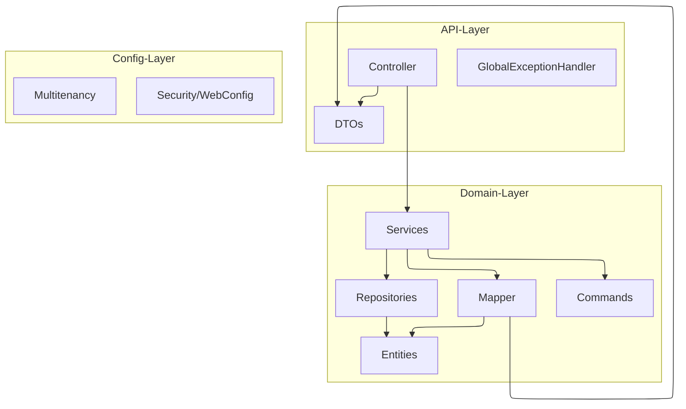

# Paket- & Klassenstruktur (Backend)

Dieses Dokument beschreibt die interne Organisation des Backends, die Verantwortlichkeiten der einzelnen Pakete und die darin enthaltenen Klassen.

## 🏗 Architektur-Übersicht

Das Backend folgt einem Schichtenmodell, wobei die Geschäftslogik in der Domänenschicht konzentriert ist.

## 📦 Paket-Details

### 1. `de.schrell.drives.config`
Konfigurationsklassen für das Framework und die Infrastruktur.

| Klasse | Beschreibung |
| :--- | :--- |
| `SecurityConfig` | Konfiguration von Spring Security (OAuth2 Login, CSRF, Authorisierung). |
| `WebConfig` | Web-spezifische Einstellungen (z.B. CORS-Header). |
| `RestTemplateConfig` | Stellt einen `RestTemplate` für Geocoding bereit. |
| `OcrProperties` | Konfigurationswerte für OCR (Tesseract-Pfade via `TESSERACT_PATH`, optionale Native-Libs via `OCR_LIBRARY_PATH`, Debug-Output via `OCR_DEBUG_ENABLED`/`OCR_DEBUG_DIR`, Bild-Preprocessing). |
| `GeocodingProperties` | Konfiguration für Reverse-Geocoding (Base-URL, User-Agent, Sprache). |

#### 📂 `config.multitenancy`
Spezialisierte Logik für den Mehrbenutzerbetrieb mit getrennten Datenbanken.

| Klasse | Beschreibung |
| :--- | :--- |
| `MultiTenantDataSourceConfiguration` | Erzeugt dynamisch DataSources pro Tenant, initialisiert Schema und Migrationen. |
| `InitializationNotificationFilter` | Servlet-Filter, der den Initialisierungsstatus im HTTP-Header `X-Db-Initialized` mitschickt. |
| `DatabaseInitializationTracker` | Hält den Status, ob ein Tenant bereits initialisiert wurde. |
| `TenantFilter` | Setzt den aktuellen Tenant aus dem Security-Context. |
| `TenantContext` | ThreadLocal-Kontext für den aktuellen Tenant. |
| `TenantAwareRoutingDataSource` | Routing-DataSource auf Basis des Tenants. |

### 2. `de.schrell.drives.drives.api`
Die Schnittstelle nach außen.

#### 📂 `api.controllers`
REST-Endpunkte für die Kommunikation mit dem Frontend.

| Klasse | Beschreibung |
| :--- | :--- |
| `DriveController` | Endpunkte für Fahrten (`/api/drives`, `/api/latestDrive`). |
| `DriveTemplateController` | Endpunkte für Fahrtvorlagen (`/api/driveTemplates`). |
| `ScanEntryController` | Scan-Flow (`/api/scan-entries`, Commit von Start/Ziel). |
| `InitializationController` | Initialisierungsstatus der Tenant-Datenbank. |
| `UserController` | Benutzerinformationen und Version (`/api/user`). |

#### 📂 `api.dtos`
Data Transfer Objects (Java Records) für Request/Response.

| Klasse | Beschreibung |
| :--- | :--- |
| `DriveRequest` / `DriveResponse` | Repräsentation einer Fahrt. |
| `DriveTemplateRequest` / `DriveTemplateResponse` | Repräsentation einer Vorlage. |
| `ScanEntryResponse` | Scan-Daten (Start/Ziel) inkl. GPS und KM-Stand. |
| `ScanEntryCommitRequest` | Payload für die Erzeugung einer Fahrt aus Scan-Daten, inkl. optionalem `reason` (Default: `OTHER`). |
| `UserResponse` | Nutzername und Server-Version. |
| `InitializationStatusResponse` | Initialisierungsflag für den aktuellen Tenant. |
| `ErrorResponse` | Standardisiertes Fehlerformat für den `GlobalExceptionHandler`. |

#### 📂 `api.handlers`
| Klasse | Beschreibung |
| :--- | :--- |
| `GlobalExceptionHandler` | Zentrales Error-Handling mit `@RestControllerAdvice`. Wandelt Exceptions in `ErrorResponse` um. |

### 3. `de.schrell.drives.drives.domain`
Der Kern der Anwendung.

#### 📂 `domain.services`
Zentrale Geschäftslogik und transaktionale Grenzen.

| Klasse | Beschreibung |
| :--- | :--- |
| `DriveService` | Steuert das Erstellen, Ändern und Löschen von Fahrten. Implementiert die Validierung (Pflichtfelder ohne Vorlage) und die Redundanzprüfung (Löschen von Werten, die dem Template entsprechen). |
| `DriveTemplateService` | Verwaltet Vorlagen. Verhindert das Löschen von Vorlagen, die noch in Fahrten referenziert werden. |
| `ScanEntryService` | Scan-Workflow: OCR, Reverse-Geocoding, Validierung und Commit zur Fahrt (inkl. optionalem `reason`, Default `OTHER`). |
| `OcrService` | Extrahiert den KM-Stand aus Fotos via Tesseract (Tess4J); zuerst wird ein CLI-ähnlicher Pass auf dem Originalbild ausgeführt, bei unplausiblen Ergebnissen folgen normaler Pass mit Vorverarbeitung und danach ein Relaxed-Fallback (OEM_DEFAULT/PSM_AUTO, ohne Whitelist). |
| `GeocodingService` | Reverse-Geocoding via Nominatim (OpenStreetMap). |

#### 📂 `domain.repositories`
Spring Data JPA Schnittstellen.

| Klasse | Beschreibung |
| :--- | :--- |
| `DriveRepository` | Beinhaltet die komplexe `findFiltered`-Abfrage mit `LEFT JOIN`, um Fahrten ohne Template nicht zu verlieren. |
| `DriveTemplateRepository` | Standardzugriff auf Vorlagen, sortiert nach Name. |
| `ScanEntryRepository` | Zugriff auf Scan-Einträge, inkl. letztem Eintrag nach Timestamp. |

#### 📂 `domain.mappers`
| Klasse | Beschreibung |
| :--- | :--- |
| `DriveMapper` | Komponente zur Konvertierung zwischen Entities und DTOs. Implementiert die Fallback-Logik (Fahrtwert vor Templatewert). |

#### 📂 `domain.entities`
JPA-Entities (Datenbanktabellen).

| Klasse | Beschreibung |
| :--- | :--- |
| `Drive` | Repräsentiert eine Fahrt. Enthält optionale Override-Felder. |
| `DriveTemplate` | Repräsentiert eine wiederverwendbare Vorlage. |
| `ScanEntry` | Persistiert Scan-Daten (GPS, Zeit, KM-Stand). |
| `Reason` | Enum für den Grund einer Fahrt (WORK, HOME, PRIVATE, etc.). |
| `ScanType` | Enum für Scan-Typ (`START`, `ZIEL`). |

#### 📂 `domain.commands`
Interne Datenstrukturen für Schreiboperationen.

| Klasse | Beschreibung |
| :--- | :--- |
| `DriveCommand` | Kapselt die Daten zum Anlegen/Ändern einer Fahrt. |
| `DriveTemplateCommand` | Kapselt die Daten zum Anlegen/Ändern einer Vorlage. |

## 💡 Besonderheiten der Implementierung

- **Lombok-Nutzung:** Es wird konsequent Lombok (`@Getter`, `@Setter`, `@RequiredArgsConstructor`) eingesetzt, um Boilerplate-Code zu vermeiden.
- **Transaction Management:** `@Transactional` wird auf Service-Ebene genutzt, um die Konsistenz der Datenbank sicherzustellen.
- **Validierung:** Jakarta Validation (`@NotNull`, `@NotBlank`) wird in den DTOs verwendet; komplexe fachliche Validierung findet in den Services statt.
